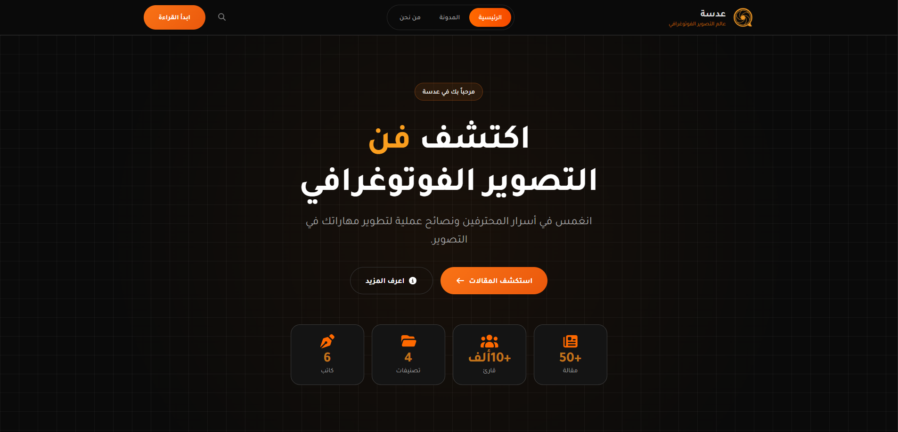
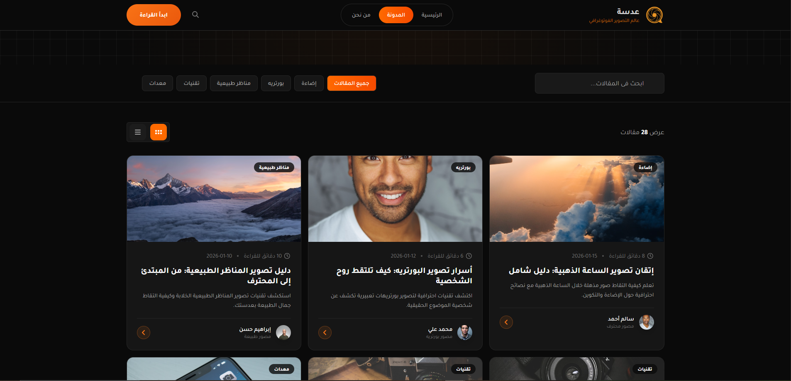
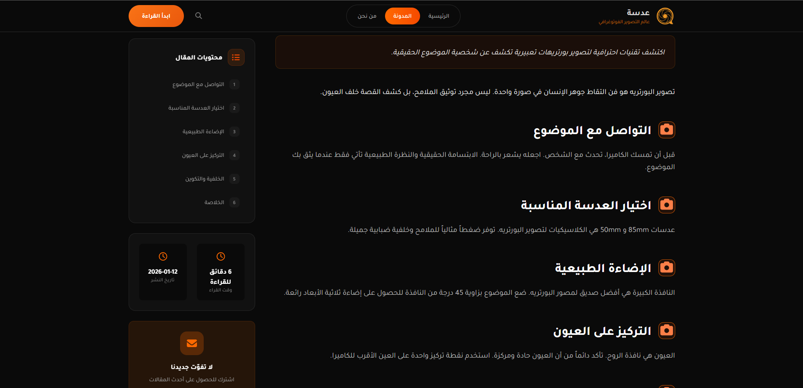
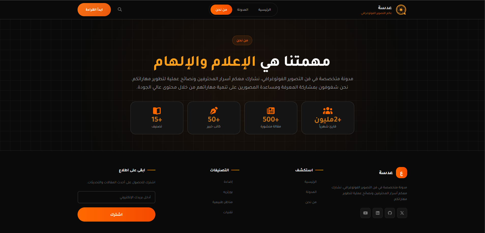
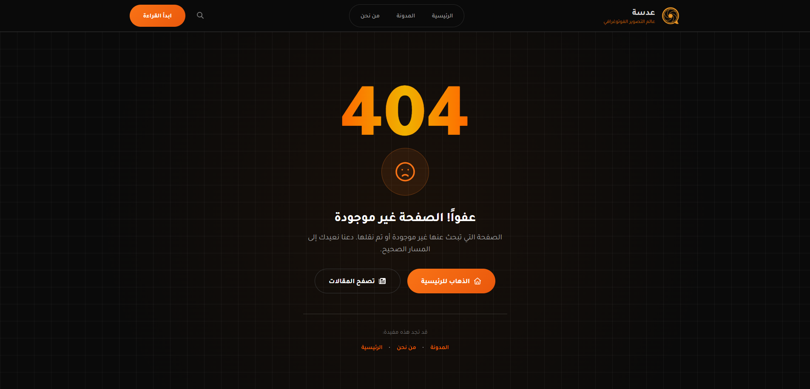

# 📸 Adasa - Photography Blog

A modern photography platform built with **Angular 20**, featuring a sleek dark UI and dynamic content management.

---

## 🚀 Live Demo
[Explore Adasa Live](https://meladessam.github.io/Adasa-Angular/)

---

## 📄 Project Pages

- **Home Page:** A professional landing page showcasing site statistics and a curated selection of latest and featured articles.
- **Blog Page:** A dynamic hub where users can filter by category, and toggle between grid and list views for all articles.
- **Article Details:** A dedicated reading space featuring a sticky table of contents and full post metadata for an immersive experience.
- **About Us Page:** A section dedicated to the site's mission and vision, highlighting the platform's impact and reach in the photography community.
- **404 Page:** A custom-designed error route to guide users back when a page is not found.

---

## 🛠️ Tech Stack
- **Framework:** Angular 20 (Routing & Components)
- **UI:** Bootstrap 5 & FontAwesome
- **Data:** Dynamic JSON file integration

---

  
  

  

  
  

